# GitHub 从单机到联机：玩转 Pull Request

最近在参与一个叫 [Exercism](http://exercism.io/) 的项目，这是一个由 [GitHub](https://github.com/) 生态工程师 Katrina Owen 发起的编程练习社区，提供了超过50门语言的练习。作为用户，你仅需使用命令行工具即可下载和提交练习，提交后还可以和社区中其他学习者交流讨论。

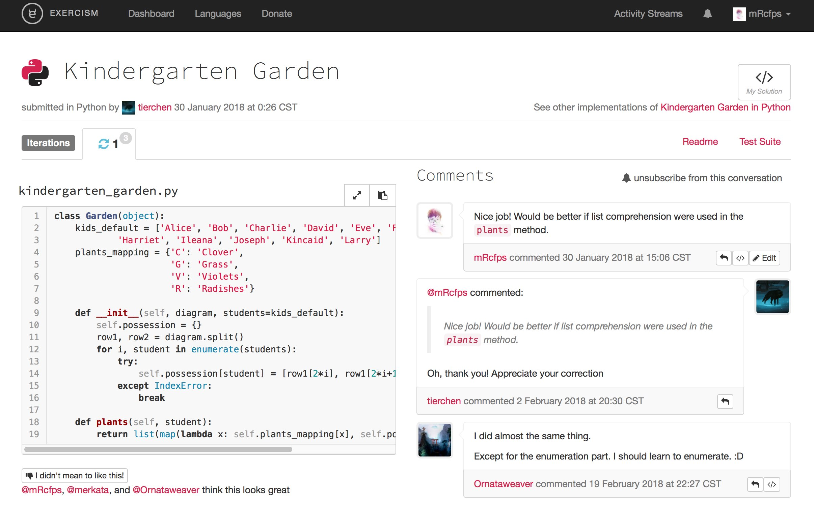

在Exercism上和世界各地的小伙伴们愉快地玩耍了十来天之后，我觉得可以为这个社区贡献些什么。由于我比较擅长 Python，所以决定为 [exercism/python](https://github.com/exercism/python) 这个仓库贡献代码。然而呢，当时的我一直处于大多数Github新手可能经历过的状态--一个人默默维护自己的仓库，却始终没有和他人互动乃至协作过，我将之称为在“单机模式”下使用Github（来自FPS发烧友的手动滑稽）。

但是呢，接下来的二十多天里，我一路刷怪升级，一步一步的踏入了开源世界，打开了新世界的大门！开始了“联机”使用Github的征途。

所以呢，我想将这份来之不易的甚至让人欣喜的经验贡献给大家，希望能够帮助像二十多天前的我一样的Github新手们或者更多想进入开源世界却无从下手的小伙伴们无缝打开新世界的大门！

接下里，我将对应 [GitHub Flow](https://guides.github.com/introduction/flow/) 手把手教会你怎么提交 Pull Request（下面简称 PR ）。

在阅读本文前，希望你已经具备以下条件：

1. 已经安装好 Git，能够用命令行进行基本的 Git 操作。如果不熟悉 Git，你可以看一下[廖雪峰的 Git 教程](https://www.liaoxuefeng.com/wiki/0013739516305929606dd18361248578c67b8067c8c017b000/)；如果你对自己的英文有自信，那么 [Learn Git Branching](https://learngitbranching.js.org/) 这个互动教程一定会让你受益更多！

2. 已经注册一个 [GitHub](https://github.com/)  帐号，并对 GitHub 的一些基本概念（例如仓库，Issue，还有我们讨论的核心 PR）有所了解。

3. 拥有一颗在开源社区呼风唤雨的雄心壮志（手动滑稽）。

## 找到想要贡献的仓库

通常，一开始刚初入Github的小伙伴了大多还没有自己心仪的可贡献的仓库，你可以通过Github的Explore功能去寻找自己感兴趣的项目。


然后选择自己喜欢或擅长的编程语言。


但是，我们希望能手把手教会你如何PR，所以即时练习是个好主意，这里我给小伙伴们提供一个供大家练手的[仓库](https://github.com/mRcfps)。小主这里对大家善意的PR来者不拒哦~

## 寻找值得解决的 Issue

通常，贡献的第一步是寻找值得解决的 Issue。选择正确的 Issue 并不简单，除了力所能及，还要看一下有没有人已经在解决这个问题。你可以看一下这个 Issue 是否有人已经回复打算解决，或者在 Pull Requests 列表中搜索一下有没有人已经在解决，否则真的就是在浪费宝贵的时间。

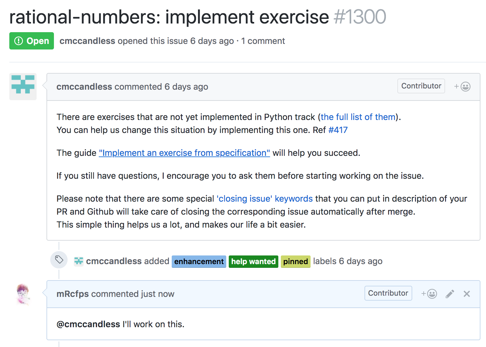

这里我们选择解决 rational-numbers: implement exercise，任务就是实现一个新的练习，名为 rational-numbers。之所以选择这个 Issue，是因为仓库维护者很认真地把实现新练习的详细步骤都告诉了我们，而且也没有其他人领这个任务。于是我们回复一句“I'll work on this”，既是通知维护者，也是告诉其他人我们已经负责解决这个 Issue，请不要重复劳动。

好了，开始动手吧！

## 准备工作

### 第一步：Fork原仓库

在页面右上角点击 Fork 按钮，随后就生成了属于你的仓库。

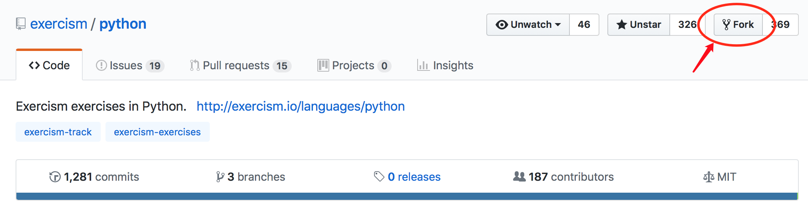

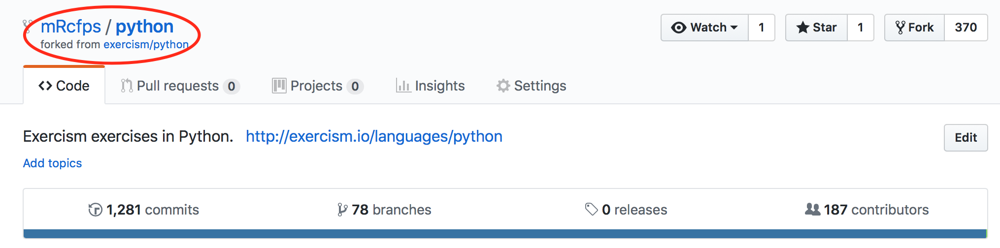

为什么要先 Fork 别人的仓库呢？不能直接把 exercism/python 直接 clone 到本地吗？

如果你只是打算阅读别人的源代码，这样做当然是可以的，然后每次你只需要 `git pull` 就可以获取最新的代码了。但如果你打算贡献代码就不能简单地 clone 了。由于你不具备 exercism/python 的 write access（写入权限），因此你就无法使用 `git push` 来推送你的修改，这时候就只能 Fork 到自己的帐号下，GitHub 会为你生成 mRcfps/python（mRcfps 是我的 GitHub 用户名）。对于这个 Fork 来的仓库，你就拥有了所有的权限（克隆、修改甚至是删除仓库）。这时候就可以进行任何想要的修改了。

### 第二步：将 Fork 来的仓库 clone 到本地

在命令行中输入下面的命令：

```bash
$ git clone https://github.com/mRcfps/python.git
Cloning into 'python'...
remote: Counting objects: 7862, done.
remote: Compressing objects: 100% (78/78), done.
remote: Total 7862 (delta 39), reused 49 (delta 12), pack-reused 7772
Receiving objects: 100% (7862/7862), 1.45 MiB | 14.00 KiB/s, done.
Resolving deltas: 100% (4315/4315), done.
```

### 第三步：创建新分支

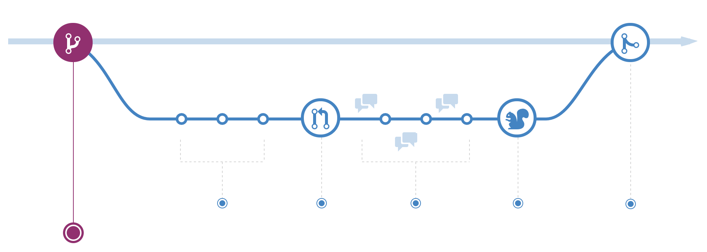

这一步是最容易被忽视的一步，却恰恰是正式开始贡献的第一步。

```bash
$ git checkout -b impl-rational-numbers
Switched to a new branch 'impl-rational-numbers'
```

这里我创建了一个新的分支 impl-rational-numbers，意思就是 implement (exercise) rational numbers。在创建分支时要尽量保证易于记忆、易于辨认，这样做有两点好处：

- 在多个分支上切换工作时会方便很多
- 在提交 PR 后便于仓库主进行维护

一个需要思考的问题是，为什么需要开新的分支？不能直接在 master 分支上修改吗？

先给出简单的回答：能，但是非常非常不推荐。

根据 GitHub Flow 的定义，master 分支应当确保始终是可部署的（deployable），所以在 master 分支上进行开发和尝试是非常不推荐的做法。而且 GitHub 的 PR 都是以分支为单位的，如果你选择 master 分支进行开发，那么当你想要解决另一个 Issue 的时候就会变得非常棘手（熟悉 Git 的朋友也许会说可以通过回退节点再开新分支，但是那样分支管理就会变得一团糟）。

## 贡献代码

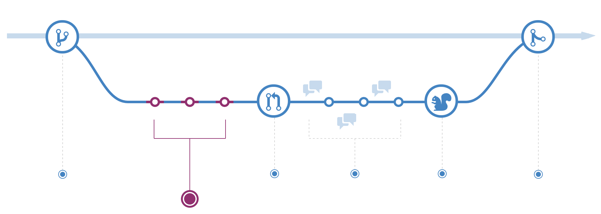

这里就不展示全部的工作了，具体代码变化请参考[这里](https://github.com/exercism/python/pull/1342/files)。

```bash
$ git status
On branch impl-rational-numbers
Changes not staged for commit:

  (use"git add <file>..."to update what will be committed)
  (use"git checkout -- <file>..."to discard changes in working directory)

      modified: config.json
      modified: exercises/rational-numbers/example.py
      modified: exercises/rational-numbers/rational_numbers.py
      modified: exercises/rational-numbers/rational_numbers_test.py
      modified: exercises/rational-numbers/README.md

no changes added to commit (use "git add" and/or "git commit -a")
```

好的，然后我们进行 commit：

```bash
$ git add .
$ git commit -m "rational-numbers: implement exercise"
```

## 提交工作

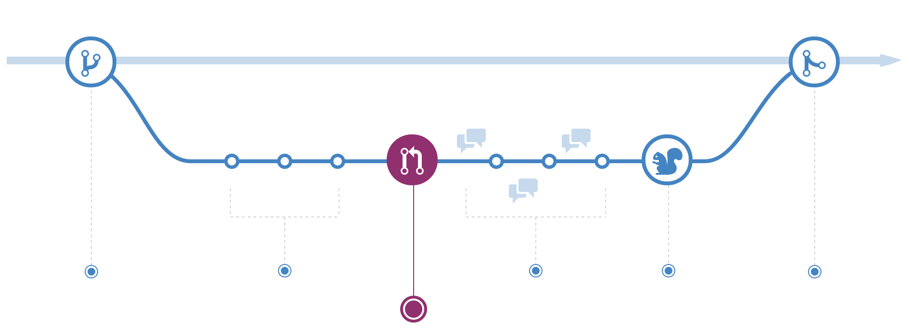

接下来就是激动人心的时刻：提交我们贡献的代码！

首先，我们需要把修改提交到 mRcfps/python ，也就是我们自己的远程仓库。

```bash
$ git push -u origin impl-rational-numbers
```

选项 `-u` 等同于 `—set-upstream`。impl-rational-numbers 就是我们刚才进行修改的分支。然后，我们打开 mRcfps/python，也就是我们 Fork 来的仓库，会看到一点小小的变化：

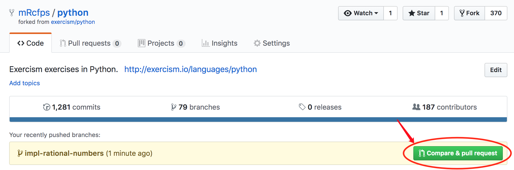

实际上如果你打开 exercism/python 的页面也会出现这样的提示。然后点击按钮 Compare & pull request，开始编辑我们的 PR：

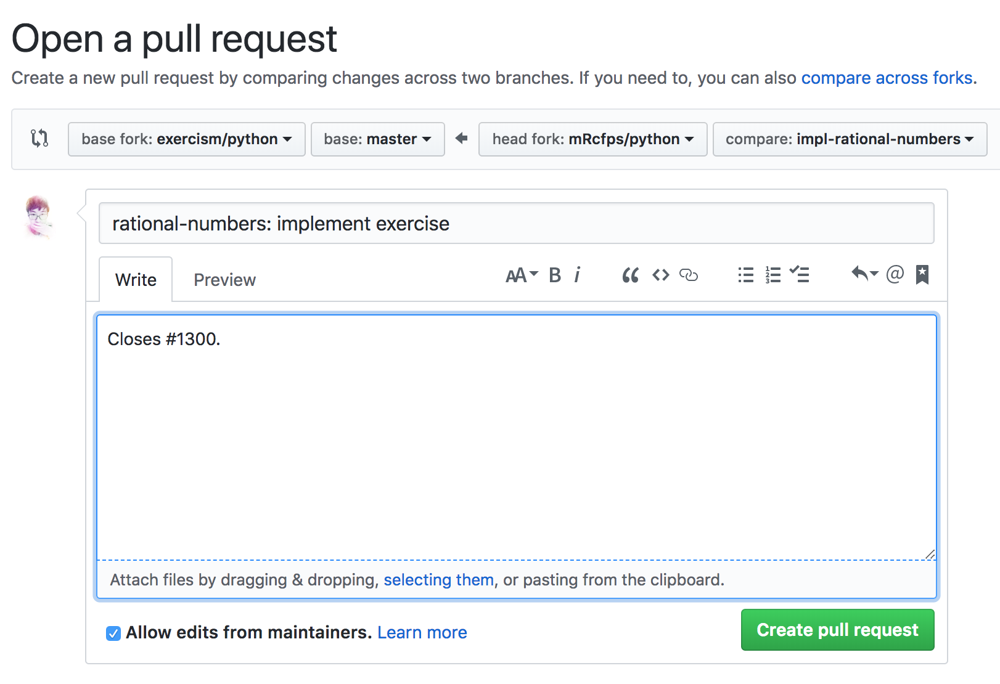

这里要说明一下 GitHub 关键词：当使用 fix(es)，close(s) 或 resolve(s) 时，如果这个 Pull Request 被合并，会自动关闭对应的 Issue。这里我标出了 Closes #1300，那么当我们贡献的代码被接受时，就会关闭 rational-numbers: implement exercise 这个 Issue。正确地使用 GitHub 关键词能够极大地方便仓库维护者，他们就不需要去查找对应的是哪个 Issue 并去手动关闭它了。

点击 Create pull request，进行提交！

## 讨论和评审

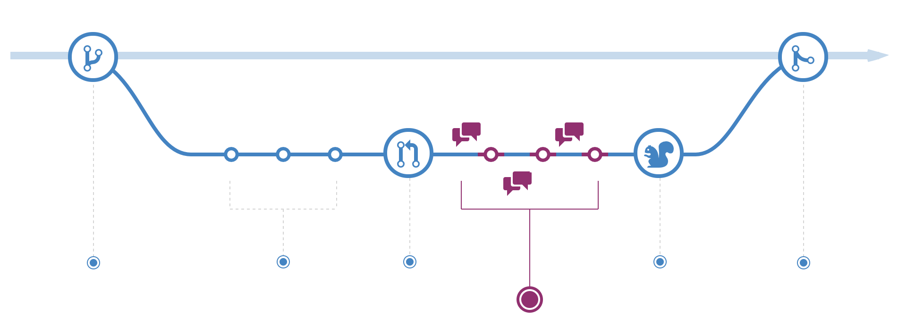

接下来就是等待。第二天起来发现仓库维护者回复我们了。

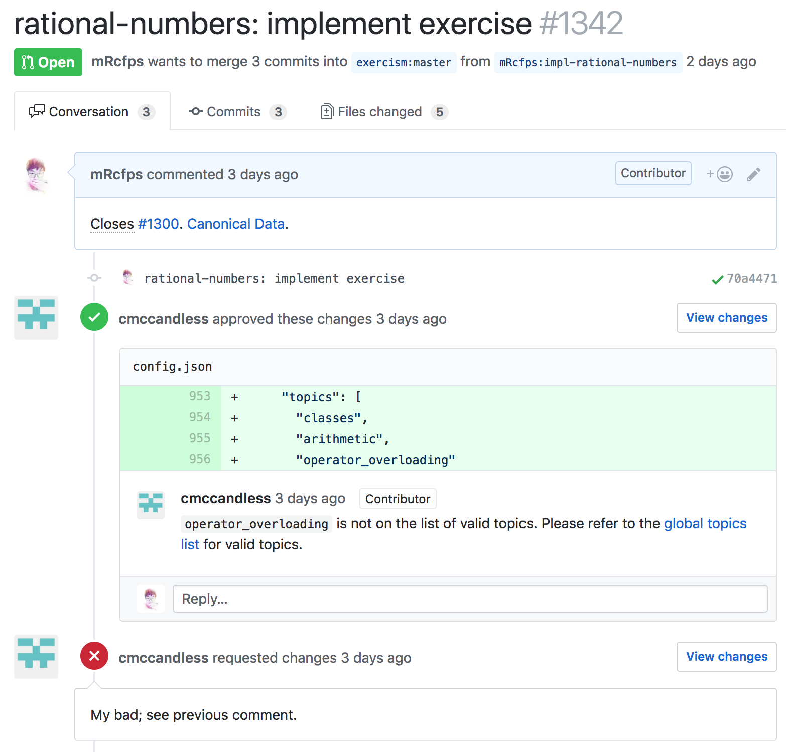

他指出我们修改的 config.json 有问题，并给出了修改建议。至于他手抖一不小心 approve 我们的修改就不必在意了（再次手动滑稽）。

按照他的建议修改好之后，我们提交新的修改。

```bash
$ git add .
$ git commit -m "rational-numbers: fix topics in config.json"
$ git push
```

可以打开 PR 页面查看我们新的修改。

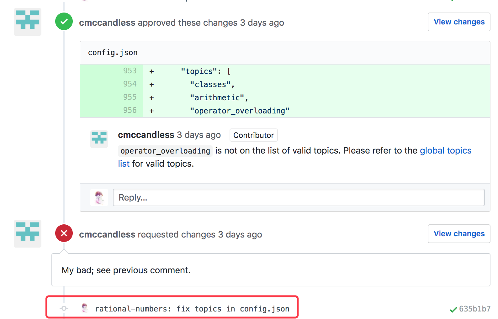

## 部署阶段

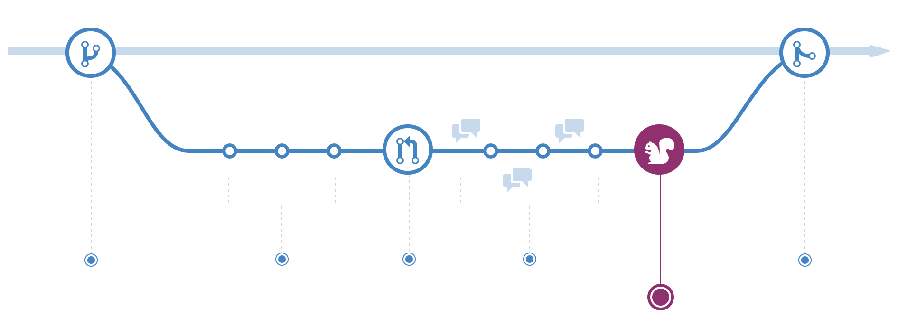

仓库维护者同意了我们的修改！

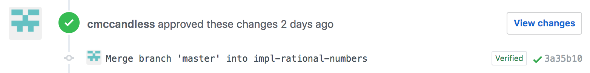

然后他将 exercism/python 的 master 分支并入了我们的 impl-rational-numbers 分支。他为什么要这么做呢？因为当我们在这个分支上工作时，exercism/python 的 master 分支上可能提交了新的修改，导致我们的分支并不是最新的。

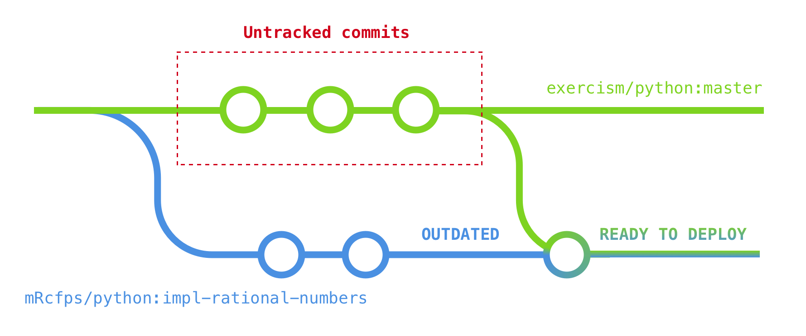

通过将 master 分支并入我们的分支，我们的分支就能进入即将部署（Ready to Deploy）状态了。如果这时候 CI （持续集成，会在后面讲到）报错，这就说明我们的分支还不能部署，还需要进一步修改甚至是回滚。但是这里，我们合并后的分支通过了 CI 的测试。

## 合并阶段

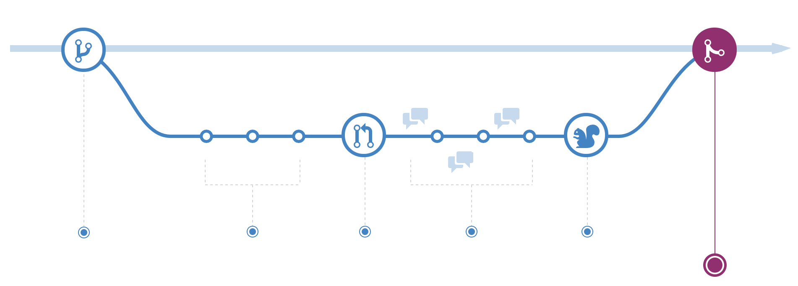

维护者紧接着就将我们的分支正式并入了 exercism/python 的 master 分支，这意味着我们的 PR 画上了圆满的句号，我们的贡献真正地进入到了原仓库！

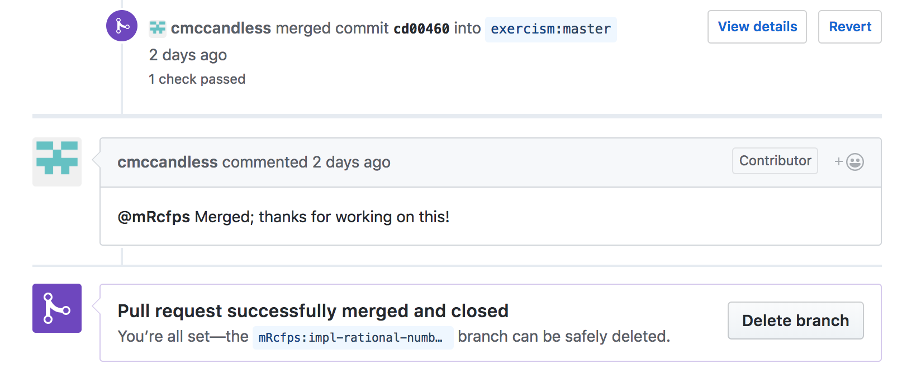

由于 impl-rational-numbers 已经合并，可以安全删除，所以我们点击 Delete branch 按钮，删除我们远程仓库 mRcfps/python 中的分支。然后在本地输入下面的命令，删除本地分支：

```bash
$ git branch -D impl-rational-numbers
```

这里为什么使用 `-D` 进行强制删除呢？因为 impl-rational-numbers 在本地并没有与 mRcfps/python 的 master 分支合并（不要绕晕了，刚才我们只是和 exercism/python 的 master 进行了合并）。我们自己的 master 分支推荐用下面介绍到的方法进行同步。

## 一些补充

关于 PR 生命周期的介绍就到此结束了。接下来我会讲一些相关的较为重要的地方。

### 保持 Fork 来的仓库同步

如果其他的贡献者向 exercism/python 提交代码，或者是我们自己提交的代码，我们的 mRcfps/python 就会过时。要经常保持我们 Fork 来的仓库与原仓库同步，这样能尽可能地降低冲突发生的概率。接下来还是以我们 Fork 来的仓库 mRcfps/python 为例，来与 exercism/python 保持同步。

首先，查看 mRcfps/python 有哪些远程仓库。这里应该只有 origin。

```bash
$ git remote -v
origin  https://github.com/mRcfps/python.git (fetch)
origin  https://github.com/mRcfps/python.git (push)
```

然后，将 exercism/python 添加进我们的 remote 仓库中，将其命名为 upstream（当然也可以取其他名字，但是按照惯例会更加方便）。

```bash
$ git remote add upstream https://github.com/exercism/python.git
```

再看看 remote 列表中是不是多了些什么……

```bash
$ git remote -v
origin  https://github.com/mRcfps/python.git (fetch)
origin  https://github.com/mRcfps/python.git (push)
upstream        https://github.com/exercism/python.git (fetch)
upstream        https://github.com/exercism/python.git (push)
```

upstream 已经在 remote 列表中！然后我们就可以轻松地进行同步了。先确保当前处在 master 分支上，然后获取 upstream 的修改，再并入我们本地的 master 分支。

```bash
$ git checkout master
$ git fetch upstream
$ git merge upstream/master
```
再把本地的更新 `push` 到 origin，也就是我们的 GitHub 仓库：

```bash
$ git push
```

同步工作完成！

### 持续集成

很多开源项目都会通过持续集成（Continuous Integration，简称 CI）来确保代码质量。对于我们贡献者来说，这意味着每次提交 PR 和继续 push 代码，CI 都会对我们的提交进行构建并执行仓库维护者指定的检查，例如代码风格检查、单元测试等等。

如果你查看你新提交的 PR，你会发现右上角有个黄色的圆圈，这表示 CI 正在检查你的提交。

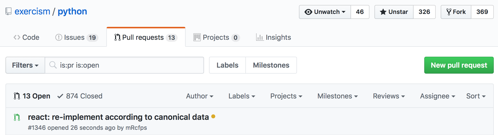

当右上角的黄色圆圈变成绿色的勾，就表示你的代码通过了 CI ！

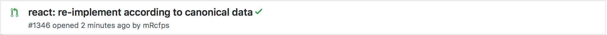

有时候会出现红色的叉，表示未通过 CI 测试。

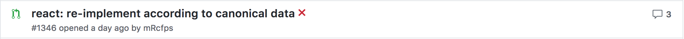

这时候我们就需要进入 PR 页面，翻到最下面，查看 Travis-CI （这个仓库使用的是流行的 Travis CI）检查的详细信息，找出错误原因后进行修改，然后 `git push` 提交我们的修改即可，直到通过 CI。

## 总结

可能步骤有点复杂，所以这里总结一下 Pull Request 的生命周期 ：

1. 确定要贡献的项目。

2. 寻找值得解决的 Issue。

3. 将原仓库 Fork 到自己的帐号下，然后克隆到本地。

```bash
$ git clone https://github.com/<YOUR_USERNAME>/<FORKED_REPO>.git
```

4. 开启新分支，修改代码并提交。

```bash
$ git checkout -b <NEW_BRANCH_NAME>
$ git add .
$ git commit -m "<COMMIT_MESSAGE>"
$ git push -u origin <NEW_BRANCH_NAME>
```

5. 打开仓库的 GitHub 页面，点击提示的 Compare & pull request 按钮，填写 PR 信息（记得使用 GitHub 关键词关闭对应的 Issue）然后提交。

6. 如果 CI 测试未通过，或者仓库维护者要求修改（request changes），那么就在本地继续修改代码，然后 `git push` 再次提交，直到通过 CI 和仓库维护者的评审。

7. 仓库维护者部署和并入你的分支，贡献完成。

## 亲自实践

这篇文章的 GitHub 仓库在[这里](https://github.com/mRcfps/play-with-pull-request)，你可以随意地发起 Issue 或 Pull Request。如果你只是想要亲自实践一下上面所讲的内容，就请在 [THOUGHTS.md](https://github.com/mRcfps/play-with-pull-request/blob/master/THOUGHTS.md) 中随意写下你的想法并提交给我，我会尽快合并你的分支。当然如果你对本文有改进意见，那更欢迎你的 Pull Request，让这篇文章变得更好！
<a rel="license" href="http://creativecommons.org/licenses/by-nc-nd/3.0/"></a><br />本作品采用<a rel="license" href="http://creativecommons.org/licenses/by-nc-nd/3.0/">知识共享署名-非商业性使用-禁止演绎 3.0 未本地化版本许可协议</a>进行许可。
